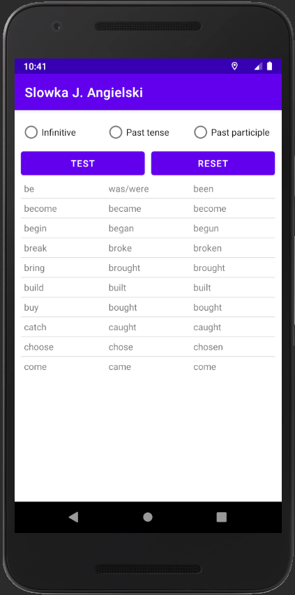
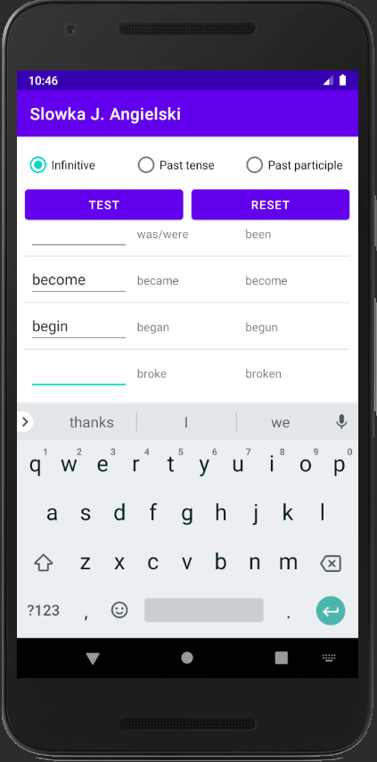
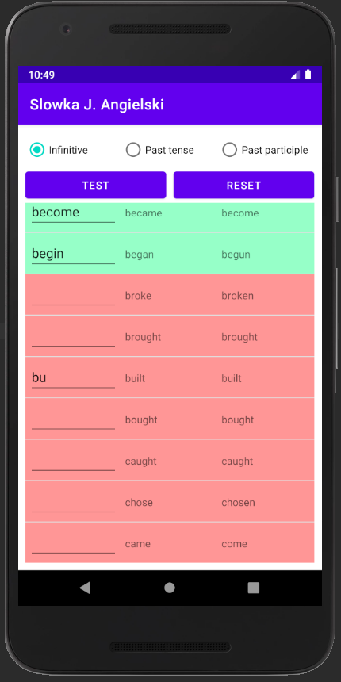
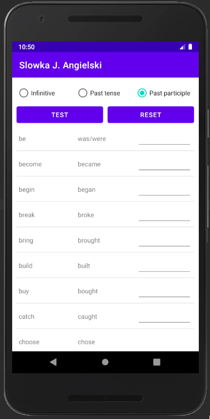
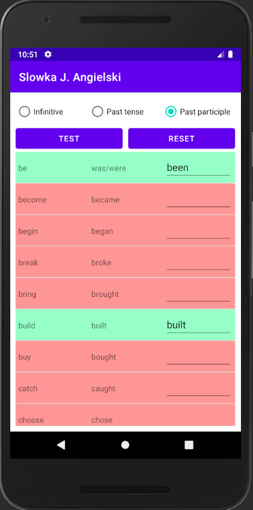

# 3 forms teacher
> This application helps you with training your English
> skills. It tests your irregular verbs knowledge.

## Table of Contents
* [General Information](#general-information)
* [Technologies Used](#technologies-used)
* [Features](#features)
* [Setup](#setup)
* [Usage](#usage)
* [Project Status](#project-status)
* [TODO list](#todo-list)

## General Information
* This application was made for "Advanced mobile
  applications" subject during studies.
* It helps you to learn irregular verbs forms.
* It provides learning mode, where you can learn new
  words.
* It provides testing mode, where you can check your
  knowledge.

## Technologies Used
- JAVA 13
- Android studio IDE (for development)

## Features
Learning mode

Testing your knowledge

## Setup
This project has no binary release avaliable yet.

I recommend using Android Studio IDE for development 
purposes. Clone the repository. Open the folder in the 
IDE. Select the `Nexus_5X_API_30_x86` configuration and
run the application.

## Usage
This application is very easy to use.

When the application is launched you see the main screen
with words. This is the default learning mode. You can
scroll through the words and read them.
Now, whenever you are ready, select one of the tenses
from the top list. You just switched to the testing
mode. The selected tense is now hidden. Fill blank
places with the correct forms. Press "TEST" button to
check your work. All correct answers are going to be
colored green, opposite to the wrong red one.
Get back to the learning mode by clicking the "RESET"
button.

## Project Status
In progress

## TODO list
* Binary release
* Online words synchronization
* Interface improvements
* Stability improvements
* Bug fixing

## Contact
Created by @ewatryniszewska - feel free to contact me!
